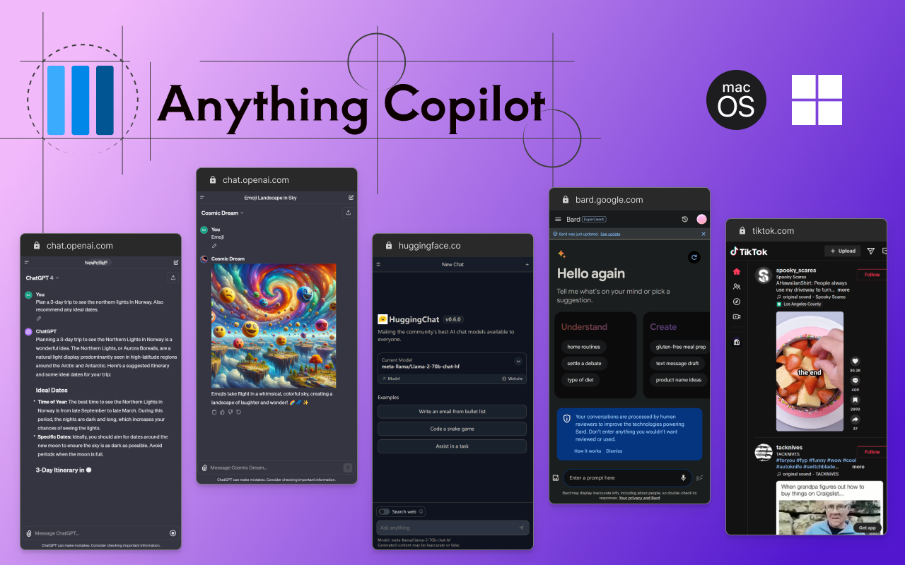
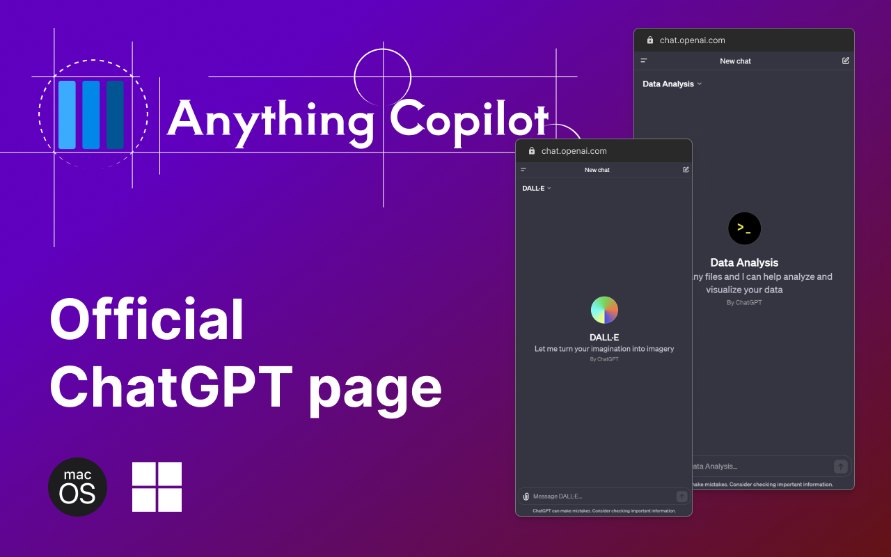

<div align="center">
  
  <h1>Anything Copilot - Any web page as copilot</h1>
  <p>Use the official ChatGPT website or any other webpage for free as your AI copilot, including GPTs, GPT-4, or any new features. </p>
</div>

## Install/Download - Edge Add-ons & Chrome web store

- [Edge Add-ons - Anything Copilot](https://microsoftedge.microsoft.com/addons/detail/anything-copilot/lbeehbkcmjaopnlccpjcdgamcabhnanl)
- [Chrome web store - Anything Copilot](https://chromewebstore.google.com/u/1/detail/anything-copilot-any-web/lilckelmopbcffmglfmfhelaajhjpcff)

Open any web page in a Copilot window and seamlessly multitask with other pages or applications.

## Screenshots & Video

<table>
  <tr>
    <td>
      
    </td>
    <td>
      
    </td>
  </tr>
</table>

[📺 Youtube - Anything Copilot demo](https://youtu.be/RnOUGg-WiH0?si=8YHPLGvczmUTsVqU)

## Recommended IDE Setup

[VSCode](https://code.visualstudio.com/) + [Volar](https://marketplace.visualstudio.com/items?itemName=Vue.volar) (and disable Vetur) + [TypeScript Vue Plugin (Volar)](https://marketplace.visualstudio.com/items?itemName=Vue.vscode-typescript-vue-plugin).

## Type Support for `.vue` Imports in TS

TypeScript cannot handle type information for `.vue` imports by default, so we replace the `tsc` CLI with `vue-tsc` for type checking. In editors, we need [TypeScript Vue Plugin (Volar)](https://marketplace.visualstudio.com/items?itemName=Vue.vscode-typescript-vue-plugin) to make the TypeScript language service aware of `.vue` types.

If the standalone TypeScript plugin doesn't feel fast enough to you, Volar has also implemented a [Take Over Mode](https://github.com/johnsoncodehk/volar/discussions/471#discussioncomment-1361669) that is more performant. You can enable it by the following steps:

1. Disable the built-in TypeScript Extension
   1. Run `Extensions: Show Built-in Extensions` from VSCode's command palette
   2. Find `TypeScript and JavaScript Language Features`, right click and select `Disable (Workspace)`
2. Reload the VSCode window by running `Developer: Reload Window` from the command palette.

## Customize configuration

See [Vite Configuration Reference](https://vitejs.dev/config/).

## Project Setup

```sh
npm install
```

### Compile and Hot-Reload for Development

```sh
npm run dev
```

### Type-Check, Compile and Minify for Production

```sh
npm run build
```
