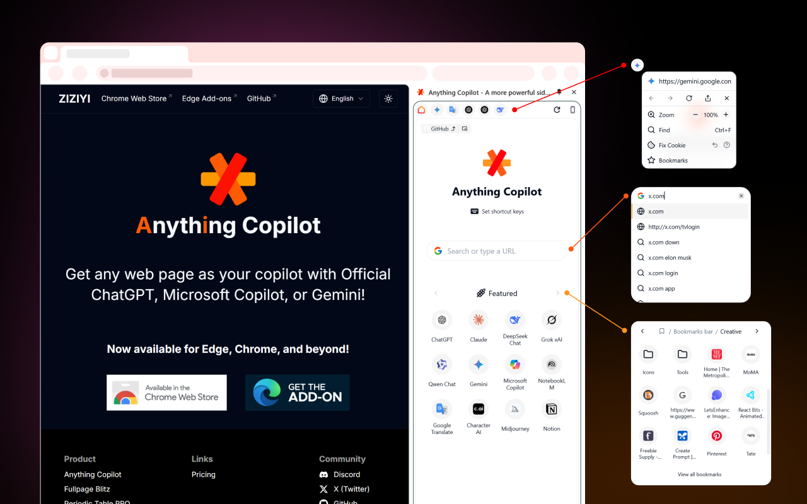
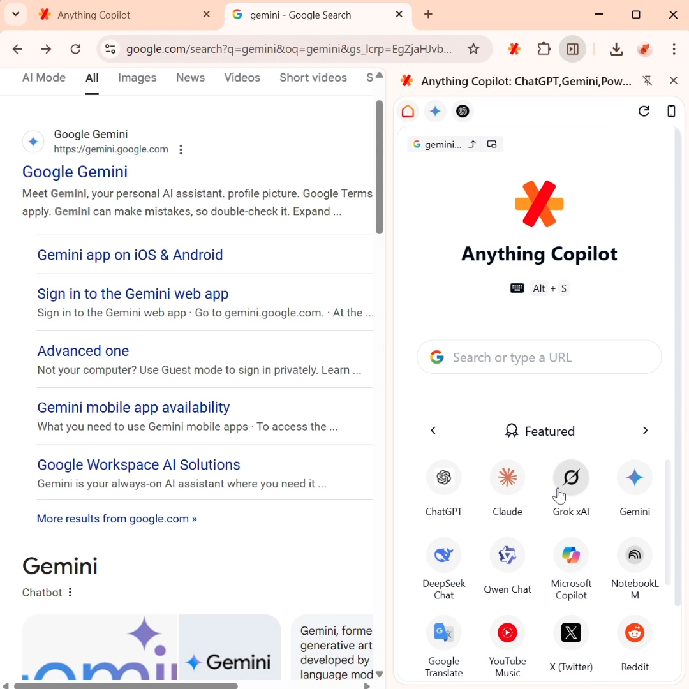
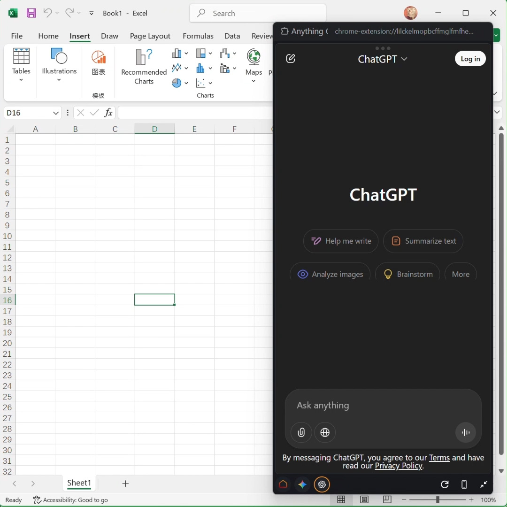

<div align="center">
  
  <h1>Anything Copilot: Powerfull Multi-tab Sidebar,Split-Screen</h1>
  <p>Bringing AI closer. Use any of your favorite AI tools for free in the sidebar or a Mini Window. </p>
</div>
<div align="center">
  <a href="https://chromewebstore.google.com/u/1/detail/anything-copilot-any-web/lilckelmopbcffmglfmfhelaajhjpcff" target="_blank">
    
  </a>
  <a href="https://microsoftedge.microsoft.com/addons/detail/anything-copilot/lbeehbkcmjaopnlccpjcdgamcabhnanl" target="_blank">
    
  </a>
</div>

## Get the Extension

Works with Chrome, Edge, Opera, Vivaldi, and more.

- [Chrome web store - Anything Copilot](https://chromewebstore.google.com/u/1/detail/anything-copilot-any-web/lilckelmopbcffmglfmfhelaajhjpcff)
- [Edge Add-ons - Anything Copilot](https://microsoftedge.microsoft.com/addons/detail/anything-copilot/lbeehbkcmjaopnlccpjcdgamcabhnanl)

- [ZIZIYI - Anything Copilot](https://ziziyi.com/anything-copilot)

## Screenshots & Video

<table>
  <tr>
    <td>
      
    </td>
    <td>
      
    </td>
  </tr>
</table>

[📺 Youtube - Mini Window](https://youtube.com/shorts/46GFbzAzboE)

## Features

### Multi-tab Sidebar: Tabbed Sidebar for Ultimate Convenience.

<p align="center">
  
</p>

Access and use multiple AI assistants and tools at the same time, right from the sidebar. Consolidate your subscriptions and seamlessly use ChatGPT Plus, Claude Pro, Gemini Pro, and others all in one place with Anything Copilot.

### Mini Window: System-Wide AI with a Floating Assistant

<p align="center">
  
</p>

We’ve brought the power of AI out of the browser and placed it right on your desktop. Our intelligent floating window stays on top of all your applications, giving you a familiar AI assistant in Office, design software, and everywhere else you work.

## Project Setup

```sh
npm install
```

### Compile and Hot-Reload for Development

```sh
npm run dev
```

### Type-Check, Compile and Minify for Production

```sh
npm run build
```
